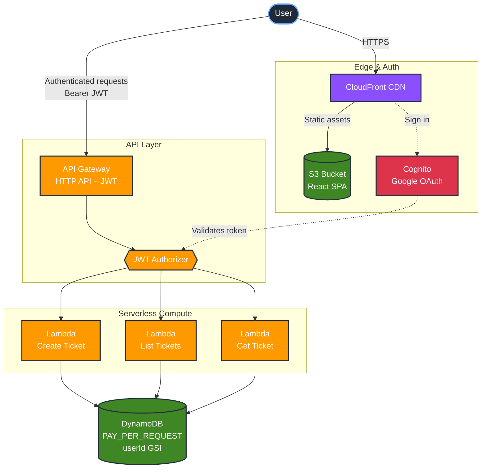

<div align="center">

# AWS AI Ticket Assistant

A full-stack, serverless cloud support ticket platform built on AWS.
End-to-end authentication, AI-assisted triage, and pay-per-use infrastructure.

[**Live Demo**](https://d29817j4dymot2.cloudfront.net) · [Report Bug](https://github.com/RafaelChipitelli/AWS-AI-Ticket-Assistant/issues) · [Request Feature](https://github.com/RafaelChipitelli/AWS-AI-Ticket-Assistant/issues)


</div>

---

## Overview

A production-ready support ticket system designed for cloud support / MSP teams. Customers sign in with Google, submit support tickets, and receive AI-generated triage analysis. The entire stack is serverless and scoped to a single AWS account, so it costs essentially nothing when idle and scales automatically when used.

This project demonstrates real-world cloud architecture patterns: federated identity, JWT-protected APIs, edge-cached static frontends, per-user data isolation, and infrastructure-as-code with strict IAM least-privilege.

## Architecture



## Features

- **Federated authentication** with Amazon Cognito and Google OAuth 2.0
- **JWT-protected API** — all endpoints require a valid Cognito access token
- **Per-user data isolation** — each user only sees their own tickets, enforced via DynamoDB GSI
- **Static frontend at the edge** — React SPA cached globally on CloudFront
- **Origin Access Control (OAC)** — S3 bucket is private; only CloudFront can read it
- **Serverless backend** — Node.js Lambdas behind an HTTP API Gateway
- **Pay-per-request DynamoDB** — no provisioned capacity, no idle cost
- **Hardened inputs** — Zod schemas with strict mode, length limits, and Unicode normalization
- **Rate limiting** — API Gateway throttling (10 req/s sustained, 20 burst) protects against abuse
- **Mock AI triage** — pluggable interface ready for Amazon Bedrock or OpenAI
- **Cost guardrails** — AWS Budget alerts at USD 5/month
- **Infrastructure as Code** — fully reproducible with Terraform
- **Least-privilege IAM** — dedicated deployer user with scoped policies

## Tech Stack

| Layer            | Technology                                                         |
| ---------------- | ------------------------------------------------------------------ |
| Frontend         | React 19, TypeScript, Vite, Tailwind CSS, AWS Amplify Auth         |
| Backend          | Node.js 20, TypeScript, AWS Lambda, Express (local dev parity)     |
| Database         | DynamoDB (on-demand) with `userId-createdAt` GSI                   |
| Auth             | Amazon Cognito User Pool + Google Identity Provider                |
| API              | API Gateway HTTP API with JWT Authorizer                           |
| Hosting          | S3 + CloudFront with Origin Access Control                         |
| IaC              | Terraform 1.6+ with AWS provider 5.x                               |
| Observability    | CloudWatch Logs (3-day retention)                                  |

## Cost

The stack is engineered for near-zero idle cost. With no traffic, you pay only for the Cognito User Pool (free tier covers 50,000 MAU), DynamoDB storage (negligible at small scale), and a Route 53 hosted zone if you add a custom domain.

| Service        | Free tier / cost model              | Idle monthly cost |
| -------------- | ----------------------------------- | ----------------- |
| Lambda         | 1M requests + 400k GB-s free        | $0                |
| API Gateway    | 1M HTTP requests free               | $0                |
| DynamoDB       | 25 GB storage free, on-demand reads | ~$0               |
| S3             | First 5 GB free                     | < $0.05           |
| CloudFront     | 1 TB egress + 10M requests free     | $0                |
| Cognito        | 50,000 MAUs free                    | $0                |
| **Total**      |                                     | **< $1/month**    |

A budget alert at USD 5/month is configured to email if costs ever exceed the threshold.

## Security

Defense-in-depth applied across the stack:

| Layer            | Protection                                                                |
| ---------------- | ------------------------------------------------------------------------- |
| Authentication   | Cognito User Pool with Google OAuth — no custom credential handling       |
| Authorization    | JWT authorizer on every API route; Lambdas re-verify user ownership       |
| Input validation | Zod schemas (strict mode) reject extra fields and enforce length limits   |
| Unicode safety   | NFC normalization to defeat homoglyph and invisible-character attacks     |
| Rate limiting    | API Gateway throttling at 10 req/s sustained, 20 req/s burst              |
| Data isolation   | DynamoDB queries scoped by `userId` from JWT — users cannot read others'  |
| Storage          | S3 bucket private; only CloudFront via Origin Access Control reads it     |
| Transport        | HTTPS-only via CloudFront, with HSTS-friendly redirect from HTTP          |
| IAM              | Least-privilege Lambda execution role; deployer user scoped by ARN prefix |
| Secrets          | OAuth secrets and `.tfvars` excluded from Git; never logged               |
| CORS             | API Gateway allows only the deployed CloudFront origin and `localhost`    |

## Project Structure

```
.
├── backend/
│   ├── src/
│   │   ├── handlers/        # Express handlers (local dev)
│   │   ├── lambda/          # AWS Lambda handlers (production)
│   │   ├── services/        # Shared business logic
│   │   ├── types/           # TypeScript domain models
│   │   └── utils/           # Validation, response helpers
│   └── package.json
├── frontend/
│   ├── src/
│   │   ├── api/             # Axios client (with auth interceptor)
│   │   ├── auth/            # Amplify config + useAuth hook
│   │   ├── components/      # React components
│   │   └── types/
│   └── package.json
├── infrastructure/
│   ├── api_gateway.tf       # HTTP API + JWT authorizer
│   ├── cognito.tf           # User Pool + Google IdP
│   ├── dynamodb.tf          # Tickets table + GSI
│   ├── iam.tf               # Lambda execution role
│   ├── lambda.tf            # Function definitions
│   ├── s3_cloudfront.tf     # Frontend hosting
│   └── main.tf              # Provider + budget guardrail
└── docs/
    ├── architecture.md
    └── setup.md
```

## API Reference

All endpoints require an `Authorization: Bearer <id_token>` header. Tickets are scoped to the authenticated user via the `sub` claim.

| Method | Endpoint        | Description                                  |
| ------ | --------------- | -------------------------------------------- |
| POST   | `/tickets`      | Creates a ticket and returns AI analysis     |
| GET    | `/tickets`      | Lists tickets owned by the authenticated user|
| GET    | `/tickets/{id}` | Returns one ticket by ID (ownership checked) |

### Request example

```json
POST /tickets
{
  "title": "Website is down",
  "description": "After deploying the new version, the website returns 502 errors.",
  "customerName": "John Smith",
  "customerEmail": "john@example.com"
}
```

### Response example

```json
{
  "id": "ticket_a4f...",
  "userId": "google_109...",
  "title": "Website is down",
  "status": "open",
  "createdAt": "2026-05-09T04:00:00.000Z",
  "analysis": {
    "possibleCause": "Misconfigured upstream after deployment",
    "priority": "high",
    "nextSteps": ["Roll back deploy", "Check load balancer health"],
    "suggestedResponse": "We are aware of the issue and investigating..."
  }
}
```

## Running Locally

The backend runs in two modes: `local` (in-memory) for offline development and `dynamodb` against a real AWS account.

### Prerequisites

- Node.js 20+
- npm
- (Optional) AWS CLI configured for DynamoDB / Lambda deploy

### Install dependencies

```bash
cd backend && npm install
cd ../frontend && npm install
```

### Run with in-memory backend

```bash
# Terminal 1
cd backend
npm run dev          # http://localhost:4000

# Terminal 2
cd frontend
npm run dev          # http://localhost:5173
```

The local Express server has authentication disabled and uses a placeholder `userId`, so you can iterate without a Cognito setup.

### Run frontend against the deployed AWS API

Create `frontend/.env`:

```bash
VITE_API_BASE_URL=https://<your-api-id>.execute-api.<region>.amazonaws.com
VITE_COGNITO_USER_POOL_ID=<region>_XXXXXXXXX
VITE_COGNITO_CLIENT_ID=<client-id>
VITE_COGNITO_DOMAIN=<prefix>.auth.<region>.amazoncognito.com
VITE_APP_URL=http://localhost:5173
```

## Deployment

### 1. Configure Google OAuth

In [Google Cloud Console](https://console.cloud.google.com), create OAuth 2.0 credentials with these authorized redirect URIs:

- `https://<cognito-domain>.auth.<region>.amazoncognito.com/oauth2/idpresponse`
- `https://<cloudfront-domain>` (added after first apply)

### 2. Provide Terraform variables

Copy and fill in `infrastructure/terraform.tfvars`:

```hcl
google_client_id     = "your-client-id.apps.googleusercontent.com"
google_client_secret = "your-client-secret"
budget_alert_email   = "you@example.com"
```

### 3. Package the Lambda bundle

```bash
cd backend
npm run package      # produces dist/lambda.zip
```

### 4. Deploy infrastructure

```bash
cd infrastructure
terraform init
terraform plan
terraform apply
```

### 5. Build and upload the frontend

```bash
cd frontend
npm run build
aws s3 sync dist/ s3://$(terraform -chdir=../infrastructure output -raw frontend_bucket_name) --delete
aws cloudfront create-invalidation \
  --distribution-id $(terraform -chdir=../infrastructure output -raw cloudfront_distribution_id) \
  --paths "/*"
```

### Tear down

```bash
cd infrastructure
terraform destroy
```

## Roadmap

- [ ] Replace mock AI triage with Amazon Bedrock (Claude or Titan)
- [ ] Custom domain via Route 53 + ACM certificate
- [ ] CI/CD with GitHub Actions (build, test, deploy on merge to `main`)
- [ ] Email notifications via SES on ticket creation
- [ ] Admin role with cross-user ticket visibility
- [ ] End-to-end tests with Playwright

## License

This project is licensed under the MIT License.

## Author

**Rafael Chipitelli** — [GitHub](https://github.com/RafaelChipitelli)
